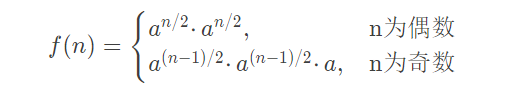

### 题目要求
求一个数的整数次方

### 题目分析
通常我们会很轻松的写出该题的思路，只需要用一个for循环即可，如下：
```go
func Power_one(data float64, n int) float64 {
	sum := 1.0
	for i := 1; i <= n; i++ {
		sum *= data
	}
	return sum
}
```
基于以上的思路，其实是有bug的，假如输入的n为0或者小于0呢？因此我们需要对我们的代码进行改进。若n < 0 ,其实我们求出的是一个倒数，即-n次方的倒数。那么我们可以对我们的代码进行如下改进，用一个标记sign记录正负：
```go
func Power_two(data float64, n int) float64 {
	if n == 0 {
		return 1.0
	}
	sign := 0
	if n < 0 {
		n = -n
		sign = 1
	}
	sum := Power_one(data, n)
	if sign == 1 && sum != 0 {
		return 1.0 / sum
	}
	return sum
```
在上面代码我们需要注意的是sum如果为0时，因为0不可为分母，因此0的倒数没有意义。返回1和0都可，但面试时需要和面试官讲清楚。

在上面的代码中，其实还有一处不太完美，我们都知道浮点数中判断两个数相等时，不能直接使用 == ,因为在计算机中表示小数是有精度损失的，一般我们认为当两个数相减时在一个很近的范围我们即认为这两个数相等。代码如下：
```go
func equal(num1, num2 float64) bool {
	if num1-num2 > -0.0000001 && num1-num2 < 0.0000001 {
		return true
	}
	return false
}
```

### 代码优化
对于上述代码我们的时间复杂度为O(n),那有没有时间复杂度更低的方法呢？举个例子，假如我们要计算2^32,如果我们已经知道了2^16,因此我们只需要在此基础上进行平方即可，同样如果我们知道了2^8,只需要在此基础上进行平方即可，按照这样的思路我们可以写出如下公式：
<br />

<br />
因此我们可以把求整数次方的代码写成递归的模式，如下：
```go
func Power_one__two(data float64, n int) float64 {
	if n == 0 {
		return 1.0
	}
	if n == 1 {
		return data
	}

	sum := Power_one__two(data, n>>1)
	sum *= sum
	//判断n为奇数还是偶数
	if n&1 == 1 {
		//	奇数
		sum *= data
	}
	return sum
}
```
在上面的代码中我们了右移来代表除法，用了位操作与运算判断奇偶性，提高我们代码的运行效率，完整代码如下：
```
// 降低时间复杂度优化
func Power_four(data float64, n int) float64 {
	if n == 0 {
		return 1.0
	}
	sign := 0
	if n < 0 {
		n = -n
		sign = 1
	}
	sum := Power_one__two(data, n)
	if sign == 1 && !equal(sum, 0.0) {
		return 1.0 / sum
	}
	return sum
}
```